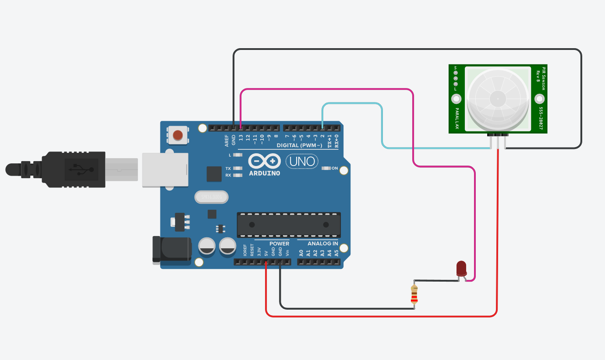
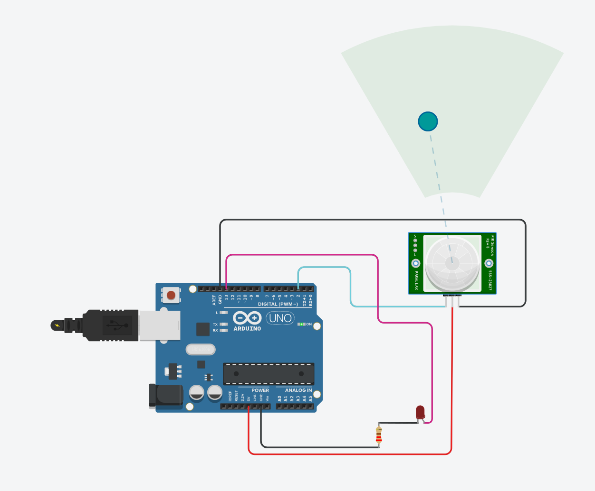
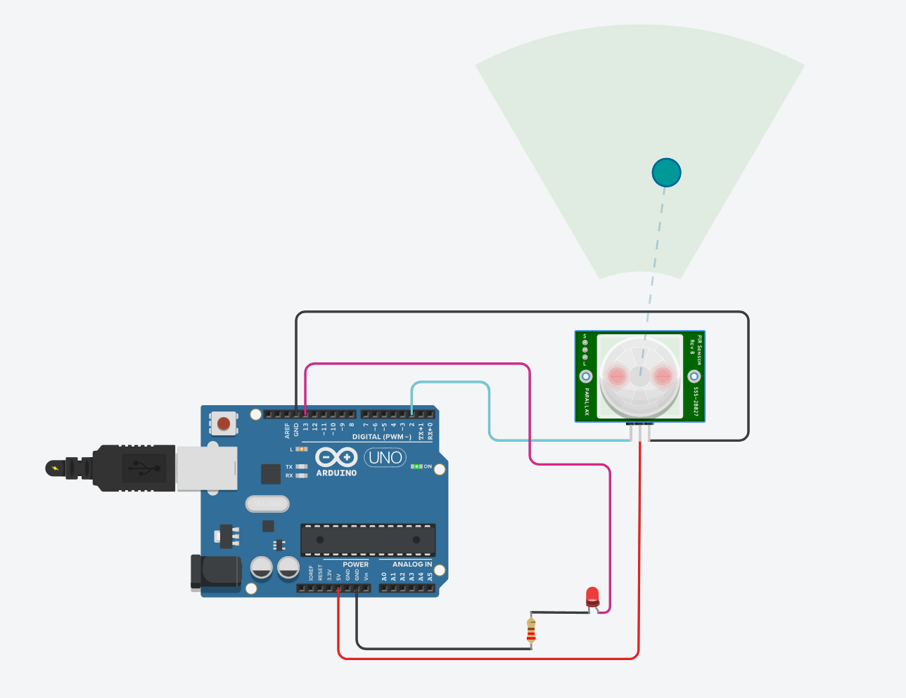
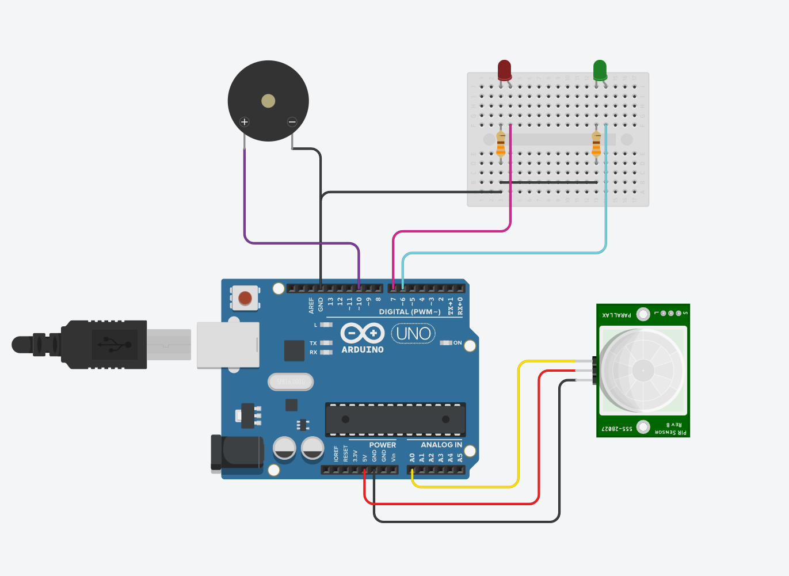
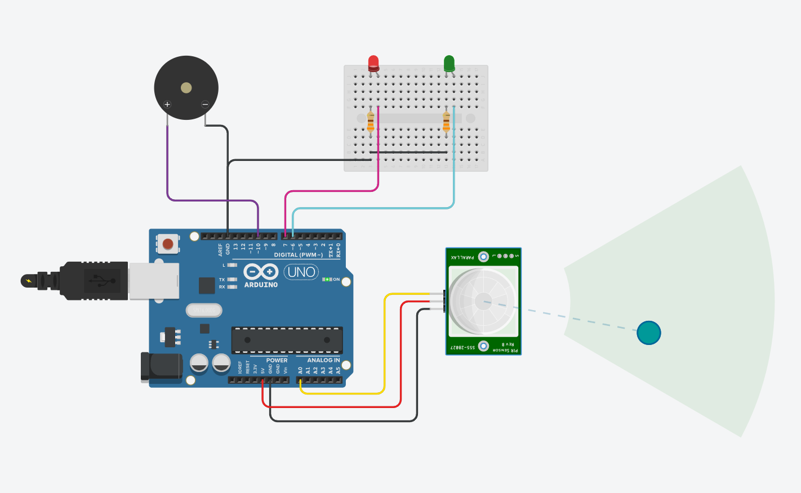
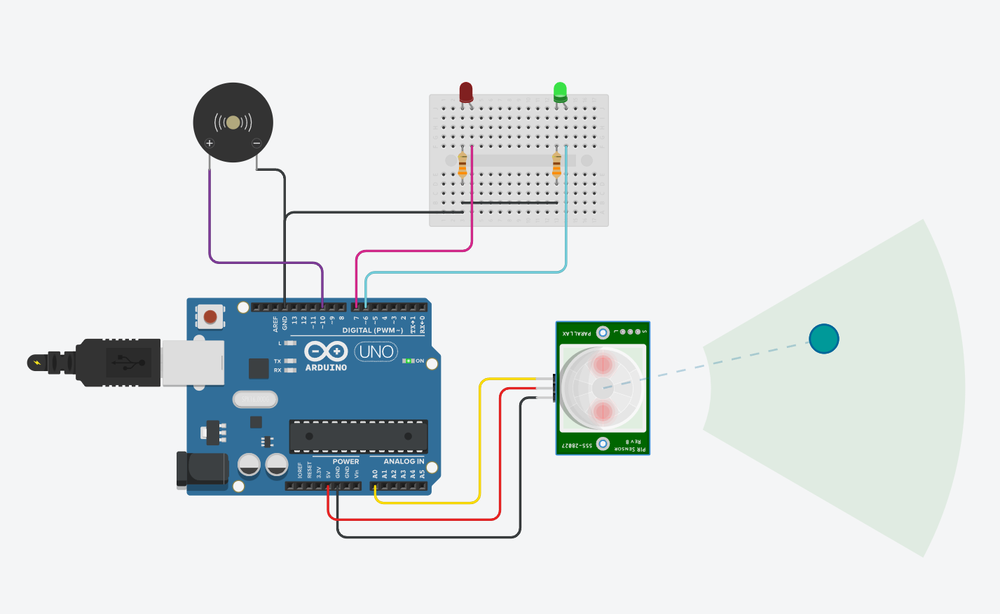

# Digital & Analog Sensors (Arduino UNO)

## Project Overview

This project demonstrates the use of both:

* 🔘 **Digital Sensor (PIR)** → ON/OFF detection
* 🔊 **Analog Sensor (PIR + Buzzer + LEDs)** → continuous values + alert system

---

# Part 1: Digital Sensor (PIR)

## What is PIR Sensor?

PIR stands for Passive Infrared Sensor

Detects motion by sensing infrared radiation from objects (like humans)
Commonly used in security systems

---

## Sensor Type

* Type: **Digital**
* Output:

  * HIGH → Motion detected
  * LOW → No motion

---

## Components Used
* Arduino UNO
* PIR Motion Sensor
* LED
* 220Ω Resistor
* Jumper Wires

---

## Circuit Connection

### PIR Sensor:

* VCC → 5V
* GND → GND
* OUT → Pin 2

### LED:

* Long leg → Pin 13
* Short leg → 220Ω → GND

---

## Circuit Diagram



---

## Arduino Code

```cpp id="dig001"
int pirPin = 2;
int ledPin = 13;

void setup() {
  pinMode(pirPin, INPUT);
  pinMode(ledPin, OUTPUT);
  digitalWrite(ledPin, LOW);
  Serial.begin(9600);
}

void loop() {
  int motion = digitalRead(pirPin);

  if (motion == HIGH) {
    digitalWrite(ledPin, HIGH);
  } else {
    digitalWrite(ledPin, LOW);
  }

  delay(200);
}
```

---

## Digital Sensor Preview

### No Motion



### Motion Detected



---

# Part 2: Analog Sensor (Motion + Light + Sound)

## What is Analog Sensor?

An analog sensor provides continuous values instead of just HIGH/LOW.

Range: 0 → 1023
Example: light, temperature, motion intensity

---

## Sensor Type

* Type: **Analog**
* Output range: 0 → 1023

---

## Components Used
* Arduino UNO
* PIR Sensor
* Buzzer
* Red LED
* Green LED
* 2 × 220Ω Resistors
* Jumper Wires

---

## Circuit Connection

### PIR Sensor:

* VCC → 5V
* GND → GND
* OUT → A0

### LEDs:

* Red LED → Pin 7
* Green LED → Pin 6

### Buzzer:

* * → Pin 10
* – → GND

---

## Circuit Diagram



---

## Arduino Code

```cpp id="ana001"
int pirPin = A0;
int redLED = 7;
int greenLED = 6;
int buzzer = 10;

void setup() {
  Serial.begin(9600);
  pinMode(redLED, OUTPUT);
  pinMode(greenLED, OUTPUT);
  pinMode(buzzer, OUTPUT);
}

void loop() {
  int pirValue = analogRead(pirPin);

  Serial.println(pirValue);

  if (pirValue > 100) {
    digitalWrite(redLED, LOW);
    digitalWrite(greenLED, HIGH);
    tone(buzzer, 1000);
  } else {
    digitalWrite(redLED, HIGH);
    digitalWrite(greenLED, LOW);
    noTone(buzzer);
  }

  delay(200);
}
```

---

## Analog Sensor Preview

### No Motion (Red LED)



---

### Motion Detected (Green LED + Sound)



---

### Full Circuit


---

## How It Works

### Digital:

* Reads HIGH/LOW
* Simple ON/OFF control

### Analog:

* Reads range (0–1023)
* Uses threshold to detect motion
* Controls LEDs + buzzer

---

## Applications

* Security systems
* Smart alarms
* Motion detection systems

